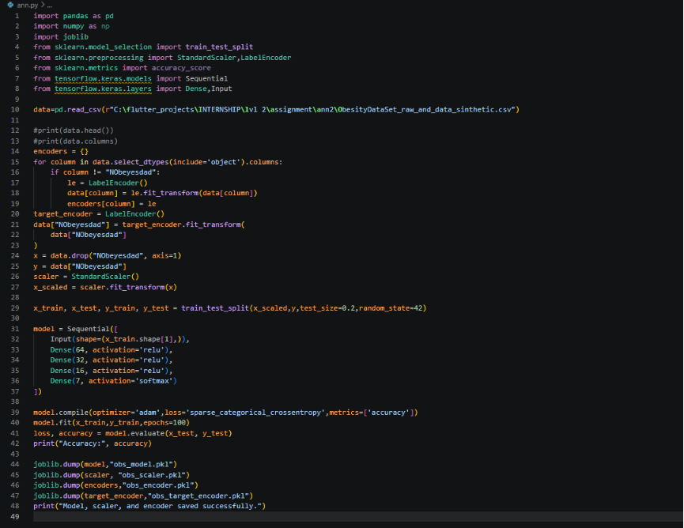
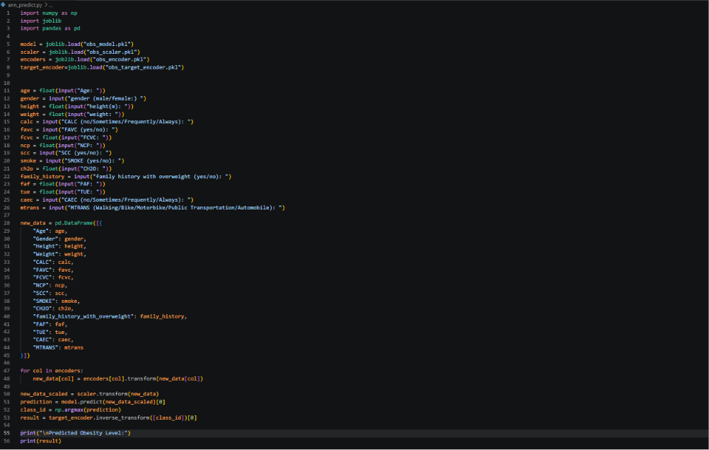
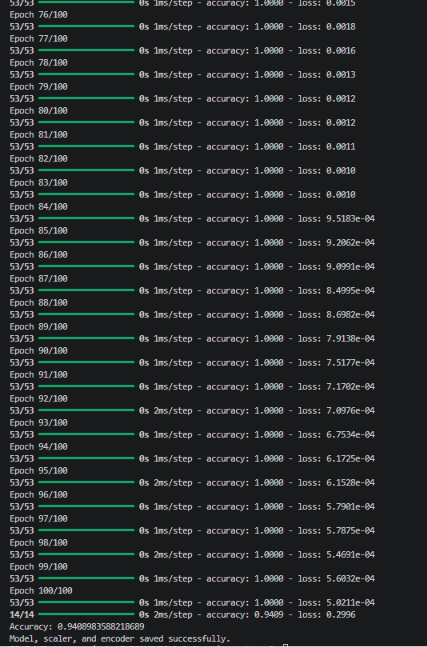
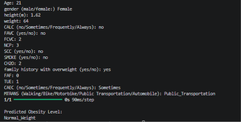
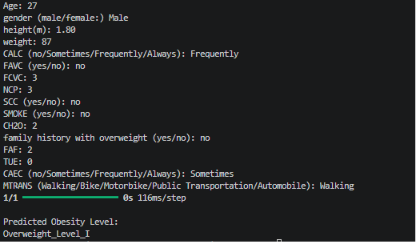
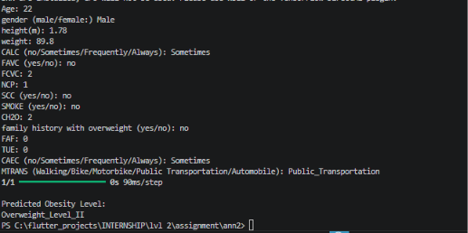
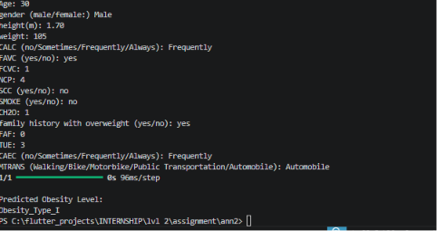
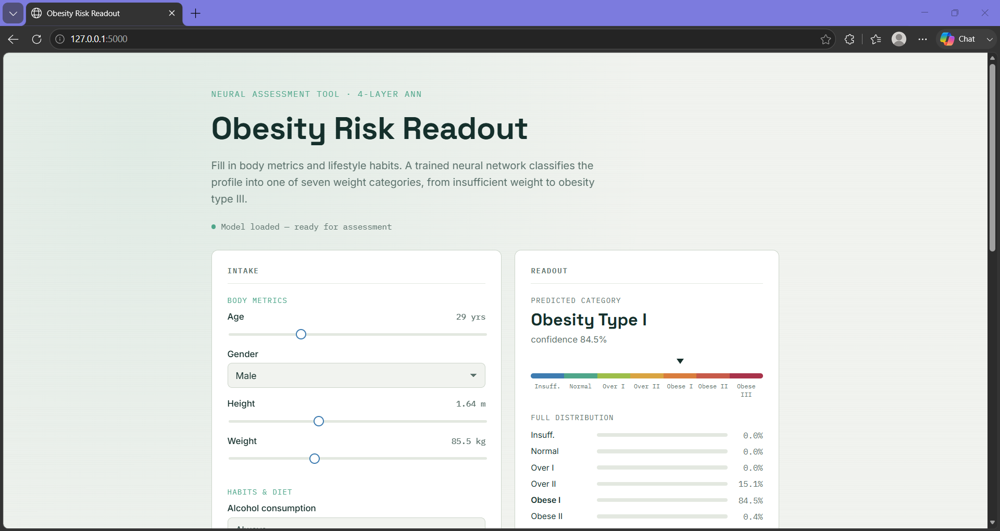

# Assignment7-ANN-Obesity-Prediction
Assignment 7 about Artificial Neural Network (ANN) done by Mithra Nandhana B A 

## Problem Statement
Predict a person's obesity level based on parameters like Gender, Age, Height, Weight, eating habits, physical activity, and lifestyle, using an Artificial Neural Network.

## Answer
Below,
1. Implementation of the ANN model is done using python (TensorFlow/Keras). The code is saved in `Assignment7-ANN-Obesity-Prediction/code/` along with the dataset `ObesityDataSet_raw_and_data_sinthetic.csv`, the training script `ann.py`, the prediction script `ann_predict.py`, and the saved model artifacts (`obs_model.pkl`, `obs_scaler.pkl`, `obs_encoder.pkl`, `obs_target_encoder.pkl`).

The code and the output along with the prediction are given below.
## *Code*

## *Predict*

## *Output*

2. A Flask web app was also built so the model can be used through a UI instead of the command line. The code is saved in the `web/` folder, containing `app.py`, `templates/index.html`, `static/script.js`, and `static/style.css`. A demo recording of the web app is available at `web/Screen Recording 2026-06-20 225435.mp4`.
## *Web App*
[Watch the demo recording](web/Screen%20Recording%202026-06-20%20225435.mp4)

## Final Answer
Given the input parameters, the model predicts the person's obesity category (e.g. Obesity_Type_I).

# What I Learned
By this assignment and class, I learned:
1. Artificial Neural Networks (ANN)
2. Data preprocessing — Label Encoding and Feature Scaling
3. Building a Flask API to serve a trained ML model
4. Building a simple web UI to interact with the model

:D
